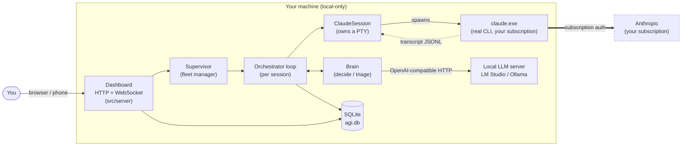
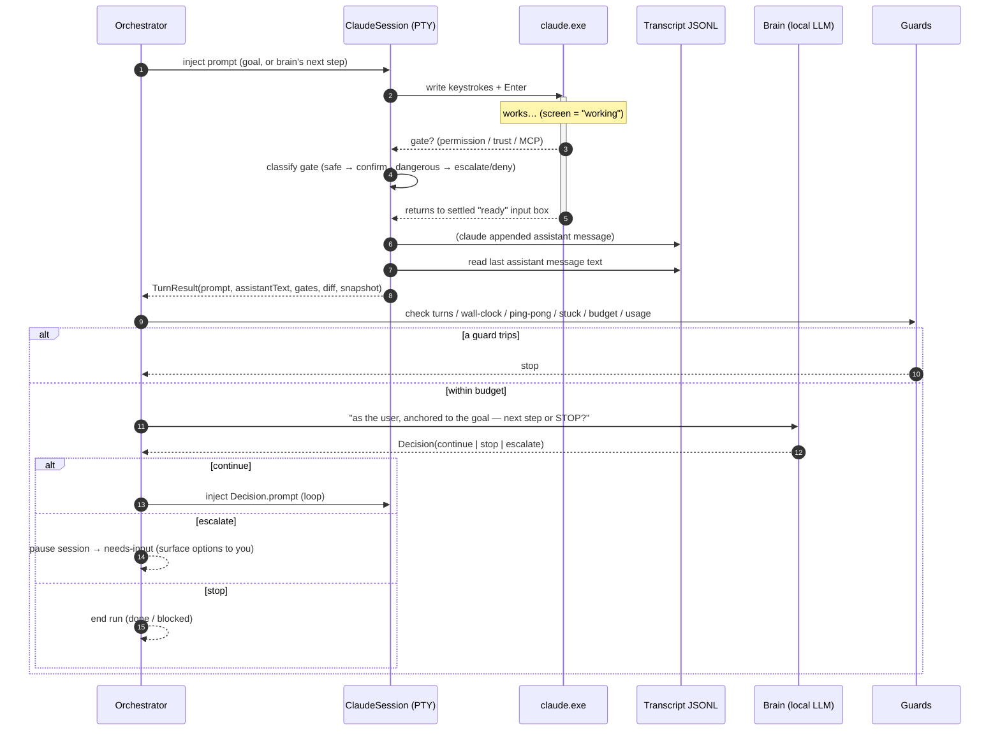
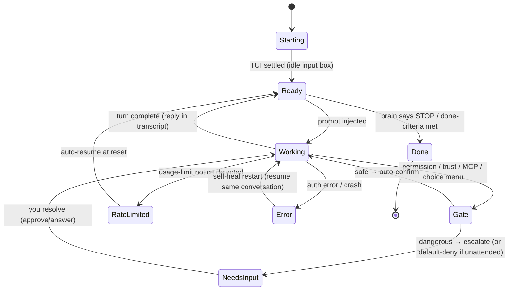
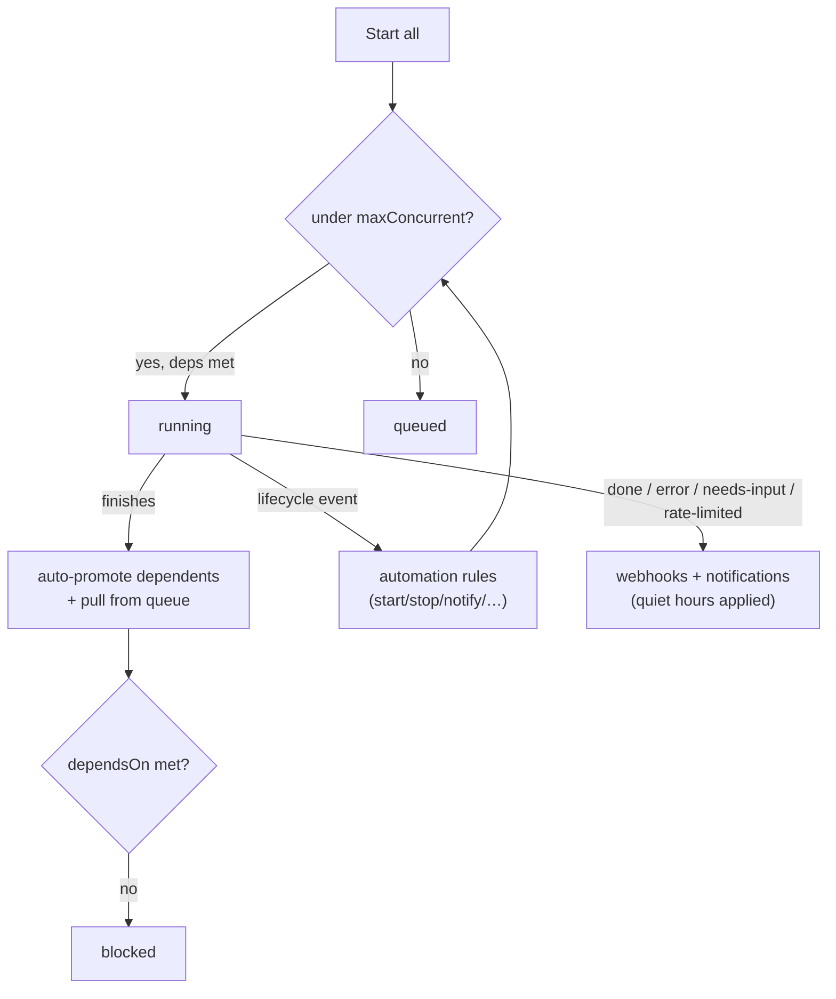
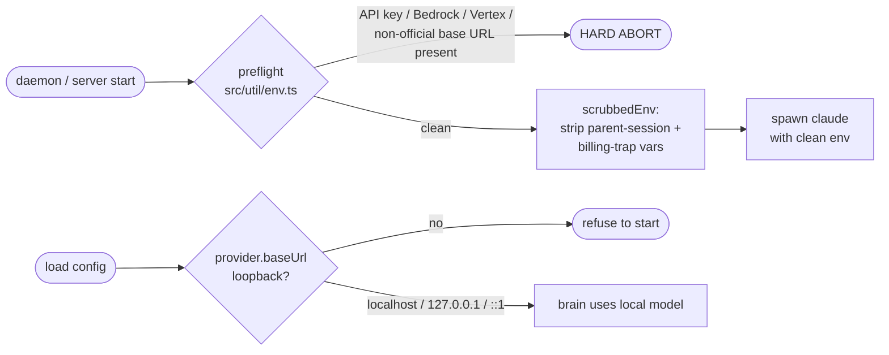
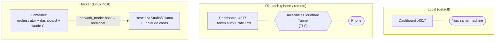

# Architecture

AGI Orchestrator drives **real, interactive `claude` CLI sessions** unattended. A **local LLM**
(the "brain") stands in for you: when a turn ends it reads what Claude said, decides the next
instruction (or STOP), and injects it. Everything runs on your machine and draws from your
Claude subscription — no Agent SDK, no API key, no pay-per-token billing.

This document is the map. For the "why it's subscription-safe" rationale see the
[README](https://github.com/Pandaismyname1/agi-orchestrator#readme); for the security model see
[SECURITY.md](https://github.com/Pandaismyname1/agi-orchestrator/blob/main/SECURITY.md).

---

## 1. System context

The **only** outbound traffic is Claude's own subscription-authenticated connection (exactly as
if you were typing by hand) and, if you enable them, optional webhooks/registry. The brain never
leaves loopback — a hard check enforces it.

---

## 2. Component map

| Layer | Module(s) | Responsibility |
| --- | --- | --- |
| **Entry** | `src/server/index.ts`, `src/daemon/index.ts`, `scripts/launch.mjs` | Preflight → load config → serve dashboard (or run headless daemon). |
| **Fleet** | `src/server/supervisor.ts` | Manages all sessions: start/stop, concurrency cap + queue, dependencies, live state to the UI. |
| **Loop** | `src/orchestrator.ts`, `src/runner.ts` | The autopilot loop for one session: drive a turn → read reply → brain decides → inject or stop. Applies guards. |
| **Session drivers** | `src/session/claudeSession.ts`, `headlessSession.ts`, `opencodeSession.ts`, `opencodeServer.ts` | Own the underlying agent process. Default: a PTY running real `claude`. |
| **Terminal** | `src/terminal/screen.ts`, `state.ts`, `gates.ts` | Headless VT emulation → clean screen text; classify working/ready/gate; classify gate danger. |
| **Transcript** | `src/transcript/reader.ts` | Read the last assistant message (and rendered tool calls) from the transcript JSONL. |
| **Brain** | `src/brain/decide.ts`, `triage.ts`, `intake.ts`, `summary.ts`, `repoState.ts`, `provider.ts` | "Act as the user": continue / stop / escalate; screen triage; goal-intake; rolling summary; git ground-truth. |
| **Policy** | `src/policy/*` | Guards, budget, usage guard, stuck detection, schedule, automation, quiet hours, reliability, context/compaction. |
| **Persistence** | `src/db/store.ts`, `recorder.ts`, `schema.ts` | SQLite record of sessions/runs/turns/decisions/events. See [DATA_MODEL.md](DATA_MODEL.md). |
| **Integrations** | `src/notify/notifier.ts`, `src/git/*`, `src/registry/*`, `src/attach/*`, `src/learning/*` | Webhooks, per-turn git diff/snapshot + auto-PR, template registry, hook-attach mode, learning loop. |
| **Safety** | `src/util/env.ts`, `src/config.ts` | Billing preflight, env scrub, loopback-only provider check. |
| **UI** | `web/` (Svelte) | The dashboard SPA: live screens, fleet control, history/metrics, all modals. |

---

## 3. The autopilot loop

The heart of the system. One iteration = one **turn**.

Key mechanisms:

- **PTY ownership** — `node-pty` (ConPTY on Windows, `useConptyDll: true`). We spawn, read the
  stream, and write keystrokes.
- **Clean screen reads** — Claude's TUI is cursor-movement escapes, not plain text. A headless
  `@xterm/headless` emulator reconstructs readable text for **state detection** only.
- **Turn-end detection** — `state.ts` classifies the screen; a turn ends when Claude settles
  back to a "ready" input box.
- **Reply text from the transcript** — the assistant message **text** comes from the transcript
  JSONL (clean and stable), located deterministically via a forced `claude --session-id <uuid>`.
- **Guards before the brain** — cheap deterministic guards can end a run without spending a
  brain call.

---

## 4. Turn state machine

How the session driver interprets the screen each turn:

Resilience (see [AUTOPILOT_brain_resilience.md](AUTOPILOT_brain_resilience.md)): a
**transcript-first recovery ladder** and **supervisor self-heal** restart a crashed run
(resuming the same conversation) with bounded backoff instead of just paging you; auth/cwd
errors never auto-heal.

---

## 5. Fleet orchestration

The supervisor turns many sessions into a governed fleet:

- **Concurrency cap + queue** — `maxConcurrent` bounds simultaneous runs; extras queue and
  auto-start as slots free (protects the rate limit).
- **Dependency DAG** — `dependsOn` parks a session as `blocked` until its prerequisites reach
  `done`; cycles are rejected. `workflowDepthCap` parks very deep chains for manual review.
- **Automations** — reactive rules generalize the DAG to any event→action pair, with a causal
  `automationChainCap` loop guard.
- **Schedules** — timer-free, clock-injectable logic (`src/policy/schedule.ts`) fires through
  the same start path, so all gating still applies.

---

## 6. Subscription-safety enforcement

Two independent guards make pay-per-token billing structurally impossible:

- **`preflight()`** aborts if the environment would route usage through the API, and
  **`scrubbedEnv()`** strips inheritable billing/auth vars before every spawn.
- **`isLoopbackEndpoint()`** refuses any brain (or escalation, or paid OpenCode) provider that
  isn't loopback.

See [SECURITY.md](https://github.com/Pandaismyname1/agi-orchestrator/blob/main/SECURITY.md) for the full threat model.

---

## 7. Deployment topologies

- **Local** — the default. Loopback is trusted; zero friction.
- **Dispatch** — expose the port to drive runs from your phone. Requires a token; use a TLS
  tunnel. See [AUTOPILOT_dispatch.md](AUTOPILOT_dispatch.md).
- **Docker** — the container runs the app + `claude`; the model and credentials stay on the
  host (host networking satisfies the loopback check). See [DOCKER.md](DOCKER.md).

---

## 8. Alternate engines

A session's `engine` selects the driver:

| Engine | Driver | Notes |
| --- | --- | --- |
| `claude` (default) | PTY running the real CLI | Full TUI experience: live screen, gates, usage/context panels. |
| `claude-headless` | `claude -p`, stream-json | Structured turn boundaries, no TUI scraping. No live screen or interactive gates (those guards are inert). Same subscription login. |
| `opencode` | `opencode serve` HTTP API | Drives the OpenCode CLI. Non-local providers require an explicit `allowPaidProvider` opt-in. |

All three route through the same orchestrator loop, brain, guards, and persistence.
