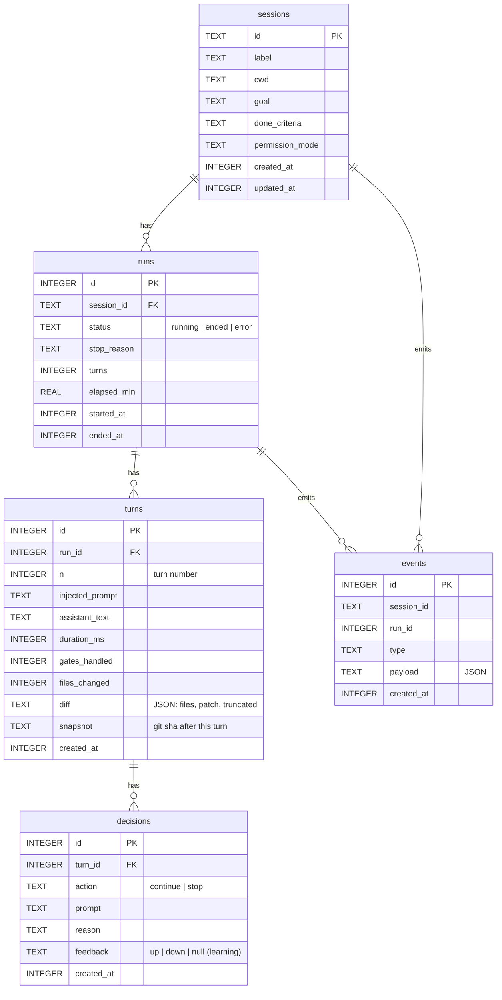

# Data model

The orchestrator keeps a structured record of every run in a local SQLite database (`agi.db` by
default, configurable via `dbPath` / `$AGI_DB`). It uses Node's built-in `node:sqlite` — **no
native build**. The JSONL transcript that `claude` writes stays the source of truth for raw
message content; this database is the structured index for **history, timeline replay, resume,
and metrics**.

Schema lives in [`src/db/schema.ts`](https://github.com/Pandaismyname1/agi-orchestrator/blob/main/src/db/schema.ts); it's written by a `Recorder`
(`src/db/recorder.ts`) that maps the orchestrator's event stream into rows. Timestamps are Unix
epoch **milliseconds** (`INTEGER`).

## Entity relationships

## Tables

| Table | Purpose |
| --- | --- |
| `sessions` | One row per configured session (id, cwd, goal, done-criteria, permission mode). |
| `runs` | One row per **run** of a session — a start-to-stop drive. Tracks status, stop reason, turn count, elapsed minutes. |
| `turns` | One row per **turn** within a run: the injected prompt, Claude's reply text, duration, gates handled, and (for git repos) the per-turn diff + a pinned worktree snapshot sha to roll back to. |
| `decisions` | The brain's decision for a turn (continue/stop + prompt + reason), plus an optional operator thumbs-up/down `feedback` used by the learning loop. |
| `events` | The raw orchestrator event stream (typed + JSON payload) — the fine-grained log behind timeline replay. |

### Provisioned for later tiers (created, may be empty)

| Table | Purpose |
| --- | --- |
| `attention_requests` | Human-decision escalations and risky-gate approvals: the question, the JSON options, the chosen option, and status (`open`/`resolved`/`timed_out`). |
| `preferences` | Key/value store scoped for the learning loop. |

## Indexes

`idx_runs_session`, `idx_turns_run`, `idx_decisions_turn`, `idx_events_session`,
`idx_events_created` — supporting the dashboard's per-session history, turn timelines, and
time-ordered event queries. `PRAGMA journal_mode = WAL` and `foreign_keys = ON` are set.

## Read APIs

The dashboard reads this store through read-only endpoints:

- `GET /api/runs` — run list (optionally per session).
- `GET /api/run` — a single run's turn-by-turn timeline (injected prompt → reply → decision →
  events).
- `GET /api/metrics` — aggregates: runs, turns, avg turns/run, intervention ("needed you")
  rate, status breakdown.

## Backups & privacy

`agi.db` (and its `-wal` / `-shm` companions) contain your goals, prompts, and Claude's replies.
They are **git-ignored** by default. Treat them as sensitive; don't commit them. To reset
history, stop the app and delete the `agi.db*` files — the schema is recreated on next start.
